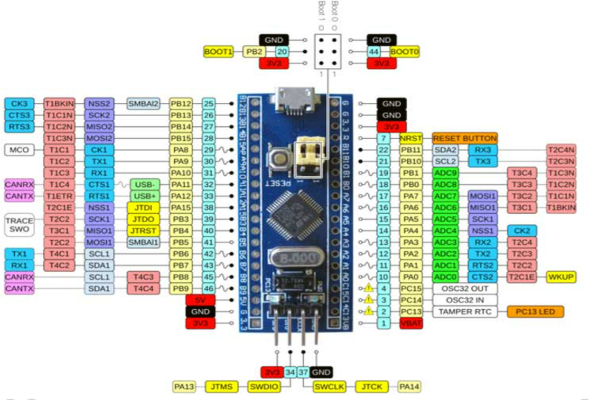
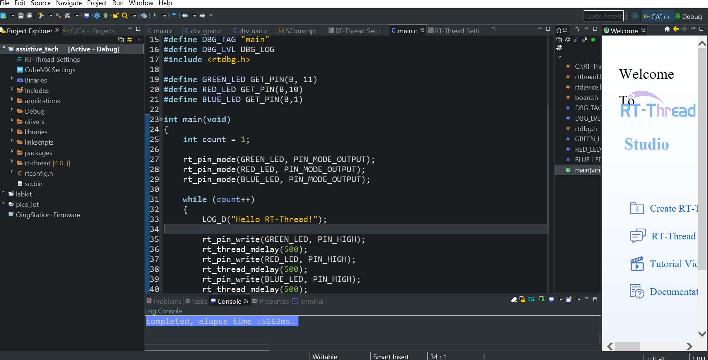
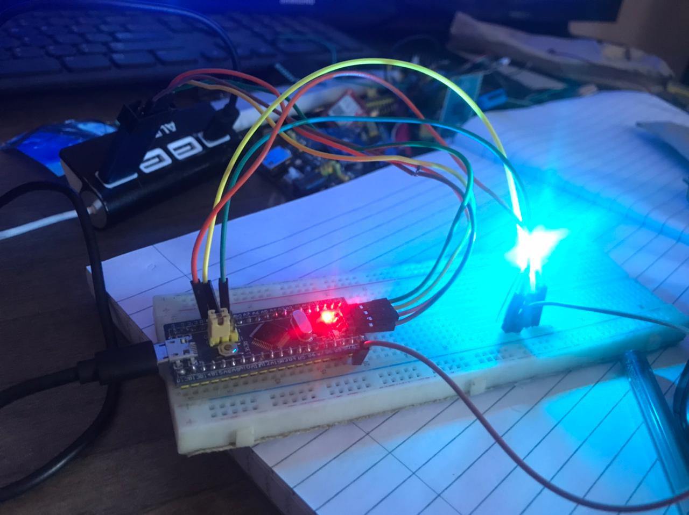
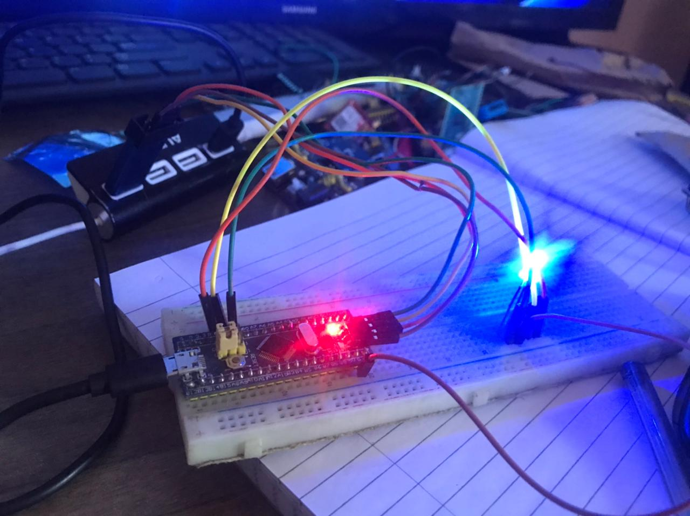
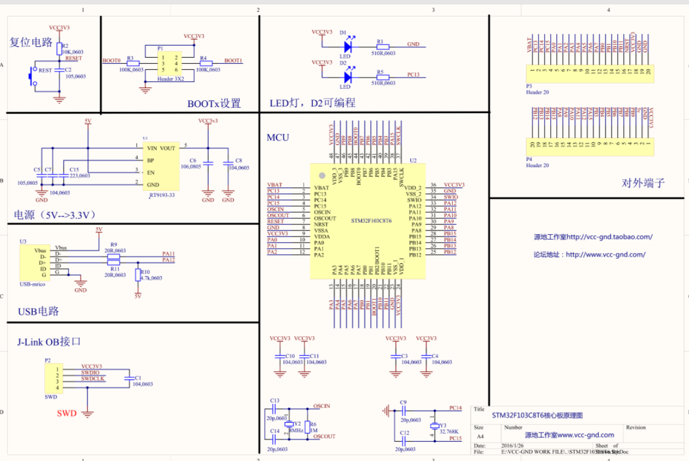
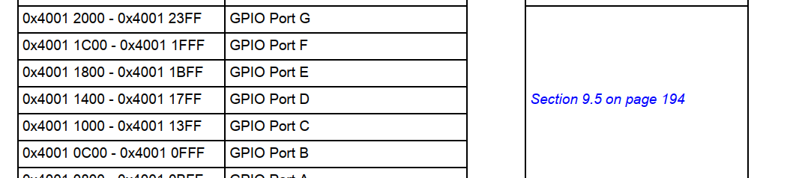

# Week 3 Assignment

## Development board : STM32F103C8T6 aka Bluepill

# Hardware Block Diagram of STM32F103C8T6

# Setting Up Development Environment

RT thread studio is an eclipse based IDE for programming microcontrollers 

# Blinking Leds
Using RT thread api you assign the leds the port and number as shown below 

#define GREEN_LED GET_PIN(B, 11)
#define RED_LED GET_PIN(B,10)
#define BLUE_LED GET_PIN(B,1)

The GET_PIN(port,pin_number) macro takes in the port and the pin number 

The leds pin modes are then setup as OUTPUTS using the special rt_pin_mode() function.
rt_pin_mode(GREEN_LED, PIN_MODE_OUTPUT);
rt_pin_mode(RED_LED, PIN_MODE_OUTPUT);
rt_pin_mode(BLUE_LED, PIN_MODE_OUTPUT);

In the loop finally you blink the leds using the  rt_pin_write()
rt_pin_write(GREEN_LED, PIN_HIGH); to turn on led 

rt_pin_write(GREEN_LED, PIN_LOW); to turn off led 
Delay is realized using the rt_thread_mdelay()  to delay in milliseconds

rt_thread_mdelay(500);

)

)

# Video link

## Without Using RT Thread HAL 

From the schematic the onboard led is in port C
)

First look at the reference manual for stm32f1xx family of microcontrollers . Download the manual and check on page 51 as shown below
)
GPIO port C has a base address at 0x4001-1000 while the RCC register has an address at 0x4002-1000.
We first activate the clock for GPIO port C by setting the RCC_IOPCEN register 

Initializing the onboard led using the registers
RCC_APB2ENR |= RCC_IOPCEN;
GPIOC_CRH &= 0xFF0FFFFF;
GPIOC_CRH |= 0x00200000;

In the main ,setup the RCC_APB2ENR register to act as an output
Next, we need to configure the port C as push-pull output. We do this by writing into register GPIOC_CRH (offset 0x04), CNF = 0b00 (push-pull output) and MODE = 0b10 (low speed). Thus, for port C13 bits 23:20 are going to be set to 0x2.

RCC_APB2ENR |= RCC_IOPCEN;
GPIOC_CRH   &= 0xFF0FFFFF;
GPIOC_CRH   |= 0x00200000;
   

# Turn on the LED
GPIOC_ODR |=  GPIOC13;
for (int i = 0; i < 500000; i++); // arbitrary delay

# Turn off the led
GPIOC_ODR &= ~GPIOC13;

# Delay for some time

for (int i = 0; i < 500000; i++); // arbitrary delay
 
