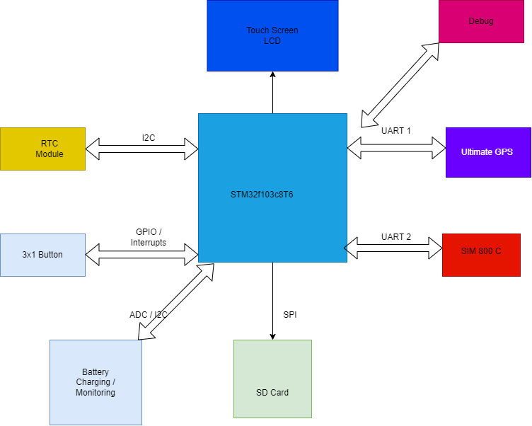

## HELP GRANDMA - Assistive technology for the Elderly 

# Project Description
Help Grandma is a connected  assitive technology device for the elderly ,sick or even just anybody that wants to get help  running errands from the comfort of their houses.
The emergence of smart speakers and voice controlled gadgets such as Amazon Alexa, Google Home etc are ideal in countries or regions where fast internet is not an issue as well as native english speakers.

In emerging  markets such as India and Asia  ,Sub saharan Africa ,Brazil etc  where connectivity is still an issue especially in rural areas 

# Hardware Architechture 
Help Grandma hardware consist of the following  

STM32F103C8T6 ; low power 32 bit processor
Adafruit Ultimate GPS module Connected to UART1
Sim 800 C GSM module -connected to UART2 
3 User buttons 
User LEDS for Network status ,battery charging / discharing
Buzzer for notification / Alarm
RTC module connected to I2C1 
SD card  connected via SPI
Battery charging and monitoring circuit on ADC 1

## SOFTWARE INTERGRATION

The firmware is developed as a baremetal application as per now . Intergration of freertos has been considered / in the pipeline.
Modules included in this version are 
          RTC module for time stamping send messages ,alarm and notification 
          3 User LEDs for implemented using Interrupts ,currently sms button only one implemented.
          GSM on uart2 for sending sms . a ring buffer is implemented to aid in managing the 2 uarts
          GPS on uart1 for getting real time location

# TODO
Develop the state machine for the firmware
Add the Touch Screen , currenly using OLED display 

## CURRENT STATUS 
RTC intergration complete with ability to set the alarm,
User Button with interrupts to trigger and send sms
User debug console / Command line interface on UART 3 
Activity Status LED

## SOFTWARE INTERGRATION

A web server to be set up for managing the sms and user information , a simple map and device console for active devices .

## FUTURE PLANS 

Include an fm radio module  for entertainment and news 
Include a media player 
Include Voice commands using Edge Impulse framework.
